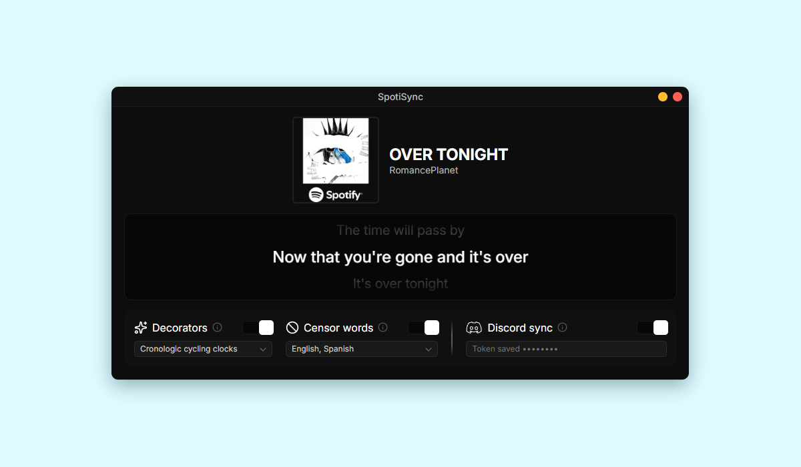

# SpotiSync

A desktop app that shows **time-synced lyrics** for whatever you're playing on Spotify. It can also mirror the current lyric line to your Discord status, censor profanity in any number of languages, and decorate the status with emojis.



## Features

- **Live synced lyrics.** The current line is highlighted and centered, with a smooth scroll and a fade on the lines above and below.
- **Track info.** Title, artists and cover art are read straight from Spotify.
- **Decorators.** Add an emoji or symbol to the Discord status (one mode at a time).
- **Censor words.** Pick any number of languages, or `ALL`. Censoring can be turned on in the middle of a song and the current lyrics are re-censored immediately.
- **Discord sync.** Mirrors the current lyric line to your Discord status.
- **Persistent settings.** Your choices are restored on the next launch. The Discord token is stored in your OS keychain, never in a plain file.

The app reads the playback position from the Windows media controls, so it doesn't need a Spotify API key or a Spotify login.

> [WARNING]
> **Discord sync** uses a user account token, which violates Discord's Terms of Service (self-botting). Your account could be banned. Use at your own risk; I accept no responsibility for actions taken against your account.

## Requirements

- **Windows 10 / 11** (playback is read through the Windows media session API)
- The **Spotify desktop app** (`Spotify.exe`)
- **Python 3.10+**

## Installation

```bash
git clone https://github.com/renvx-0/SpotiSync.git
cd SpotiSync

python -m venv .venv
.venv\Scripts\activate

pip install -r requirements.txt
```

## Usage

1. Open the Spotify desktop app and play a song.
2. Run the app:

   ```bash
   python app.py
   ```

3. Use the panel at the bottom of the window to configure the options below. Changes apply instantly and are saved automatically.

## Options

### Decorators

Prefixes the Discord status with an emoji or symbol. Only one mode can be active at a time. These only affect the Discord status, so **Discord sync** must be enabled for them to have any visible effect.

| Mode | Effect |
|------|--------|
| `FIRST_LETTER` | Replaces the first letter (or digit) of the line with a letter/number emoji |
| `FACE` | A random face emoji on every line |
| `MUSIC` | A random music-related emoji on every line |
| `SPINNING_ARROWS` | Cycles through ⬆️ ➡️ ⬇️ ⬅️ |
| `SPINNING_SYMBOLS` | Cycles through `\|` `/` `—` `\` as a text prefix |
| `CLOCKS` | Cycles through clock emojis in chronological order |

### Censor words

Pick any combination of languages from the dropdown, or choose **ALL**. Profanity is replaced in both the lyrics window and the Discord status.

- Turning censorship on, off, or changing languages while a song is playing rebuilds the current lyrics right away.
- Language codes the installed profanity library doesn't support are skipped, and a message is printed to the console.
- Add your own words in `censor_lists/blacklist.txt` (censored) and `censor_lists/whitelist.txt` (never censored). Use one word per line.
- Every censored line is logged to `censor_lists/censor_logs.txt`.

### Discord sync

Turns on status updates and stores your Discord token in the system keychain (Windows Credential Manager) through [`keyring`](https://pypi.org/project/keyring/).
> READ WARNING AT THE END OF THE FEATURES SECTION

## Configuration and data

| What | Where |
|------|-------|
| Settings | `~/.spotisync/settings.json` |
| Discord token | OS keychain (service `SpotiSync`) |
| Censor lists and log | `censor_lists/` |

## Troubleshooting

- **No lyrics appear.** Not every song has time-synced lyrics available. Check the console for `<-- No synced lyrics found -->`.
- **Nothing happens at all.** Make sure the app is the desktop Spotify client, not the web player, and that a track is actually playing.
- **No console output.** Run with `python -u app.py`, or start the window with `webview.start(background, debug=True)` and use *Inspect* to see JavaScript errors.
- **"Token saved" never shows up on Linux/macOS.** The app is Windows-only, so keyring support on other platforms isn't tested.

## Disclaimer

SpotiSync is an independent project and is not affiliated with or endorsed by Spotify or Discord. Lyrics belong to their respective rights holders and are only fetched for personal display; the app does not store them.

## License

**CC BY-NC-SA 4.0**

You are free to share and adapt this project for **non-commercial purposes**, as long as you:
* Give appropriate credit.
* License adaptations under the same terms.

[View the full license](https://creativecommons.org/licenses/by-nc-sa/4.0/)